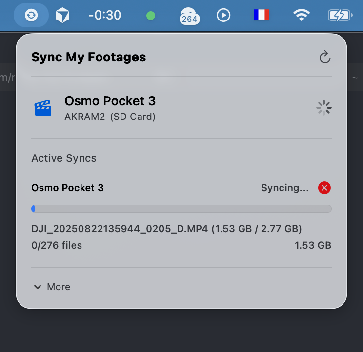
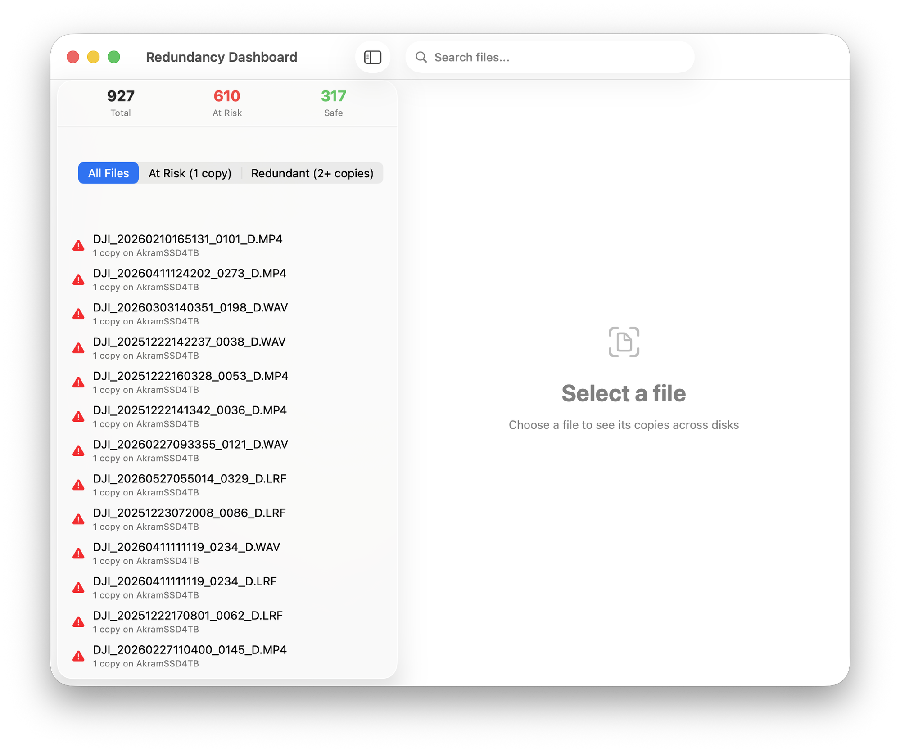
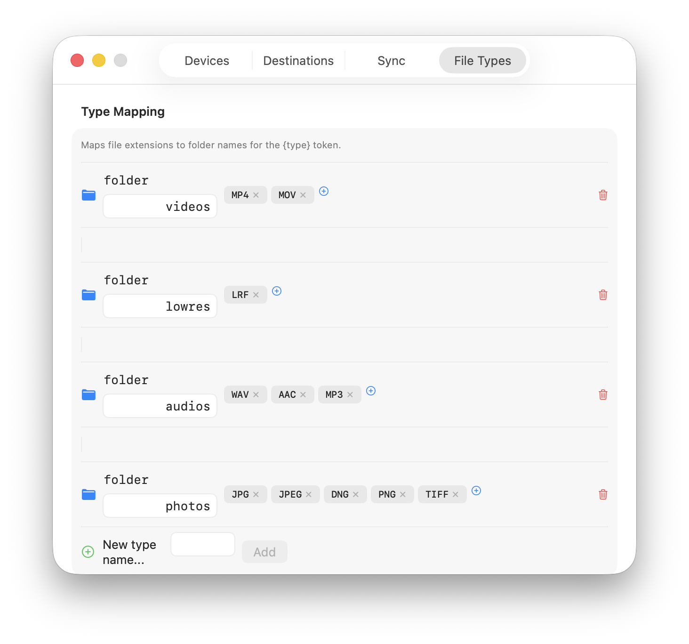

# Sync My Footages

Native macOS menu bar app for syncing video rushes from capture devices to external drives with SHA256 tracking.



## Features

- **Auto-detect capture devices** — Osmo Pocket 3, Osmo Action 5 Pro, Neo 2 via USB or SD card adapter
- **One-click sync** — click Sync to copy new files to your configured destinations
- **Smart skip** — only copies files that don't already exist on the destination (by size comparison)
- **SHA256 journal** — tracks every synced file with checksums for integrity verification
- **File organization** — configurable pattern with `{device}`, `{year}`, `{month}`, `{day}`, `{type}` tokens
- **File type sorting** — videos, audios, lowres (LRF), photos in separate folders with editable mapping
- **PROJECT.md** — drop a PROJECT.md in a date folder to rename it with the project title
- **Duplicate scanner** — find and remove duplicate files across destinations
- **Multi-destination** — sync to multiple drives simultaneously
- **Progress tracking** — real-time file-by-file progress with size display for large files
- **Hash cache** — persistent SHA256 cache for instant re-sync
- **Source change detection** — skip sync entirely if nothing changed (via Volume UUID)
- **Additive only** — never deletes files from destinations

## Screenshots

| Redundancy Dashboard | File Type Mapping |
|:---:|:---:|
|  |  |

## Install

### From GitHub Releases

1. Download the latest `Sync-My-Footages-X.Y.Z.dmg` from [Releases](https://github.com/akram/sync-my-footages/releases)
2. Open the DMG and drag the app to Applications
3. First launch: right-click the app, then click **Open** (required for unsigned apps)
4. The app appears as an icon in the menu bar

### Build from source

```bash
git clone https://github.com/akram/sync-my-footages.git
cd sync-my-footages
swift build -c release
# Run directly:
.build/release/SyncMyFootages
# Or package as .app:
bash scripts/package.sh
```

## Requirements

- macOS 15 (Sequoia) or later
- Apple Silicon or Intel Mac

## Supported Devices

| Device | Detection | Storage |
|--------|-----------|---------|
| Osmo Pocket 3 | Encoder tag in MP4 metadata | Internal + SD Card |
| Osmo Action 5 Pro | Encoder tag in MP4 metadata | Internal + SD Card |
| Neo 2 | Encoder tag in MP4 metadata | Internal + SD Card |
| Any capture device | DCIM/DJI_xxx folder structure | SD Card via adapter |

## Quick Start

1. **Configure a destination** — Open the menu bar popover, click More > Settings > Destinations, add your external drive
2. **Connect your capture device** — Plug in via USB or insert the SD card
3. **Click Sync** — Files are copied to `{device}/{date}/{type}/` on your destination
4. **Add project metadata** — Create a `PROJECT.md` in a date folder:

```markdown
---
title: Morocco Trip
---
```

Then use Reorganize (Settings > Sync) to rename the folder to `20251222 - Morocco Trip`.

## Documentation

See [docs/guide.md](docs/guide.md) for the detailed user guide covering:
- File organization patterns and tokens
- File type mapping configuration
- PROJECT.md workflow
- Journal and hash cache system
- Performance optimizations
- Duplicate scanner
- Demo mode

## License

MIT
